# regression


linear
======

links
-----

- <https://scikit-learn.org/stable/modules/linear_model.html>
- <https://scikit-learn.org/stable/user_guide.html>
- <https://scikit-learn.org/stable/modules/generated/sklearn.metrics.r2_score.html#sklearn.metrics.r2_score>

files
-----

download csv [here](../files/csv/Advertising.csv)

generalized flow
----------------

```python
from sklearn.model_family import ModelAlgo

# create instance of that model
mymodel = ModelAlgo(param1, param2)

# train the model
mymodel.fit(X_train, y_train)

# get predictions
predictions = mymodel.predict(X_test)

# import some error metric function for performance evaluation
from sklearn.metrics import error_metric
performance = error_metric(y_test, predictions)
```

Ordinary Least Squares
----------------------

minimize residual error

y = m.x + b -\> with multiple features you need gradient descent to
scale this m = slope of line (m=0 -\> zero slope, + pos, - neg slope) b
= cross w y-axis when x = 0 b = y-intercept

X = multiple features (x1, x2, x3..) y = vector label (eg Price)

ŷ (prediction) = bx + .. + bn xn (n = number of features in your
dataset)

ŷ = b0 + b1.x

(the slope) b1 = Pearson Correlation Coefficient (x) Standard Deviation
(y) / std dev (x)

b1 = P(x,y) . stdev(y) / stdev(x) b0 = y̅ - b1.x̅

example
-------

calculate relation hours of operation (x) with estimated production
volume (y)?

calculate averages = x̅, y̅

```
x    y   x-x̅  y-y̅  (x-x̅)(y-y̅)  (x-x̅)²
34  102  -6   -32     192        36   b1 = 558/124 = 4.5
35  109  -5   -25     125        25   b0 = 134 - (4.5 x 40) = -46
39  137  -1     3      -3         1   y̅ = -46 + 4.5x
42  148   2    14      28         4
43  150   3    16      48         9
47  158   7    24     168        49
------------------------------------
x̅,y̅ 40  134          sum: 558       124
```

so if the manager wants to produce 125 units/week he should run the
plant for: y̅ = b0 + b1.x 125 = -46 + 4.5x

with more than 1 feature this becomes unscalable so we shift focus on
minimizing a cost function with gradient descent

gradient descent = minimization of cost function

```
n
y̅ = E    Bi.Xi
i=0
```

sum of squared errors for M rows (the predictions)

J = cost function divide by m to get the mean

all rows (residual error ² (minimize squared error))

```
err between real y & predicted y̅
               m                     |
J(B) = 1/2m . E  . (y^j - y̅^j)²  <----
             j=1
```

gradient = omgekeerde driehoek

X:

   matrix X of all the features datapoints

Y:

   vector of all the known y labels

B:

   vector of beta coefficients to minimize the gradient descent aka
    derivative aka minim of cost function)

cost function calculation in python

prepend x vector with a vector of 1\'s (multiplying matrices you need
correct dimensions)

```python
inner = np.power(((X @ theta.T) - y, 2)
```

x = 171/4.5 = 38 hours per week work needed

beta coefficients
-----------------

using polyfit to calculate beta coefficients

### np.polyfit

```python
import pandas as pd
import numpy as np
import seaborn as sns
import matplotlib.pyplot as plt
import sklearn

df = pd.read_csv("data/Advertising.csv")
df['total_spend'] = df['TV'] + df['radio'] + df['newspaper']

# explore relationship with regplot
sns.regplot(data=df, x='total_spend', y='sales')
plt.show()

X = df['total_spend']
y = df['sales']

# calculate Ordinary Least Squares with polynomial fit (set degree to 1 for lin reg)
beta_coefficients = np.polyfit(X, y, deg=1)
# polyfit returns [0.04868788 4.24302822]

# vector to minimize gradient descent/cost function
beta1, beta0 = beta_coefficients[0], beta_coefficients[1]
potential_spend = np.linspace(0, 500, 100)  # 100 points
predicted_sales = beta1 * potential_spend + beta0
```

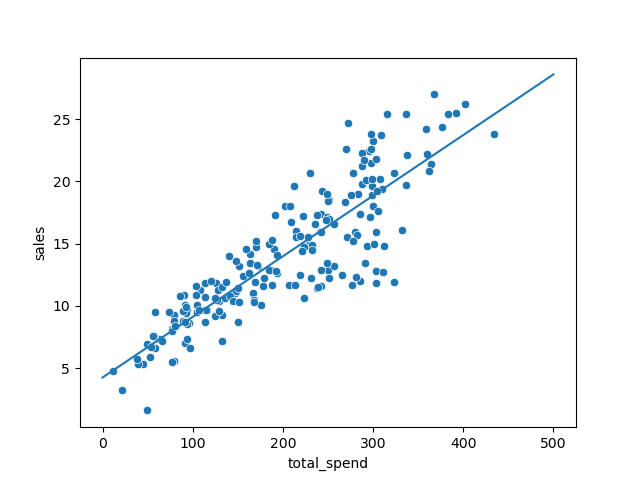

cost functions (sum of errors² between estimate & true observation in
lin regression)

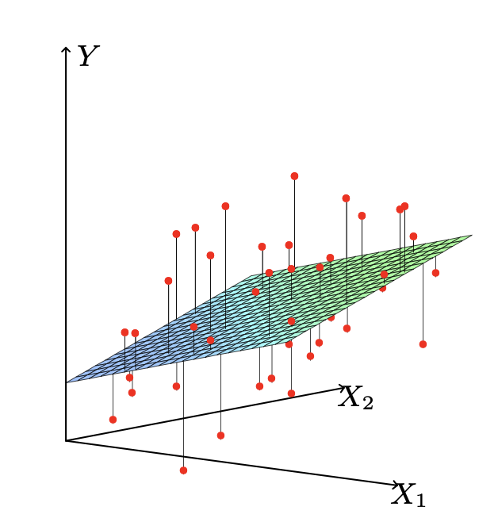

```python
plt.clf()
plt.plot(potential_spend, predicted_sales)  # our lin regression line
sns.scatterplot(data=df, x='total_spend', y='sales')
plt.show()
```

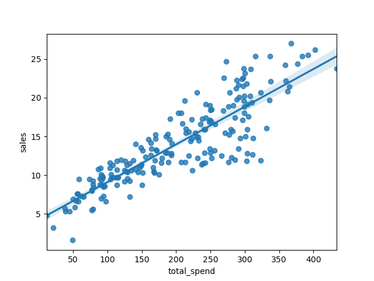

```python
ad_spend = 200
predicted_sale = beta1 * ad_spend + beta0
print(predicted_sale)
# for an ad spend of 200usd = 13.98060407984596 units
```

```python
betas = np.polyfit(X, y, deg=3)  # y = B3x³ + B2*x² + B1x + B0
b3, b2, b, y_intercept = betas[0], betas[1], betas[2], betas[3]
pot_spend = np.linspace(0, 500, 100)

pred_sales = b3 * pot_spend ** 3 + b2 * pot_spend ** 2 + b * pot_spend + y_intercept
plt.clf()
sns.scatterplot(data=df, x='total_spend', y='sales')
plt.plot(pot_spend, pred_sales)  # our lin regression line
plt.show()
```

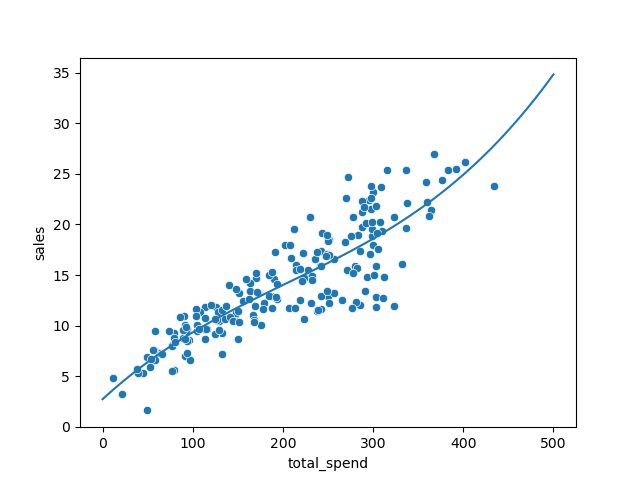

```python
plt.clf()
sns.pairplot(df)
plt.show()
```

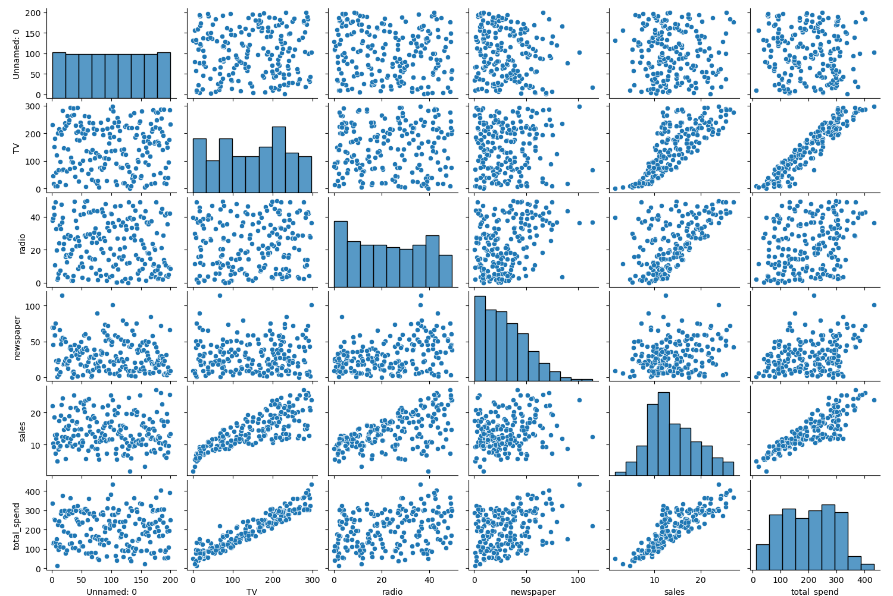

```python
plt.clf()
fig, axes = plt.subplots(nrows=1, ncols=3, figsize=(16,6))

axes[0].plot(df['TV'], df['sales'], 'o')
axes[0].set_ylabel('Sales')
axes[0].set_title("TV Spend")

axes[1].plot(df['radio'], df['sales'], 'o')
axes[1].set_ylabel("Sales")
axes[1].set_title("Radio Spend")

axes[2].plot(df['newspaper'], df['sales'], 'o')
axes[2].set_ylabel("Sales")
axes[2].set_title("newspaper Spend")
plt.tight_layout()
plt.show()
```

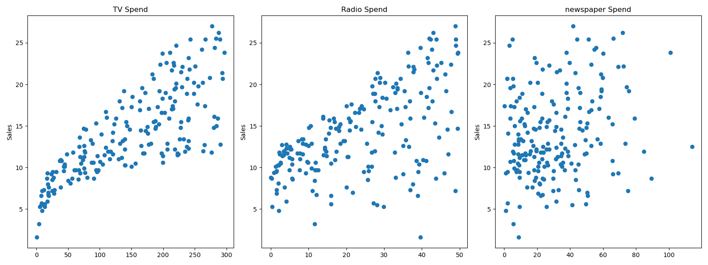

train\_test\_split
------------------

```python
# store features as X by just dropping the label|target "sales"
df = df.drop(['Unnamed: 0','total_spend'], axis=1)
X = df.drop("sales", axis=1)
y = df['sales']

from sklearn.model_selection import train_test_split
# help(train_test_split)
# train_test_split & shift + tab to get help in jupyter

# features                            test_size = data % left out that goes into test set
X_train, X_test, y_train, y_test = train_test_split(X, y, test_size=0.3, random_state=101)
#                   labels                                               set a random seed
# shuffles perhaps already sorted data      use same randomness if doing multiple ml algos
# it retains the index

# create the model aka estimator
from sklearn.linear_model import LinearRegression
# print(help(LinearRegression))
# default params typed out
model = LinearRegression(fit_intercept=True, normalize=False, copy_X=True, n_jobs=None)
model.fit(X_train, y_train)  # returns model object: LinearRegression()
# print(len(X_train))  # 140
```

regression is a task when a model attempts to predict continuous values
(eg sales) unlike categorical values, which is classification (eg
predict country given a house its features) there are no in between
values for separate countries


a RMSE for your label of 10€ is great for a house, not for a candy bar
context is important compare your error metric to the average value of
the label

```python
X_test.head()
test_predictions = model.predict(X_test)

from sklearn.metrics import mean_absolute_error, mean_squared_error
print(df['sales'].mean())  # 14.0225

plt.clf()
sns.histplot(data=df, x='sales', bins=20)
plt.show()
```

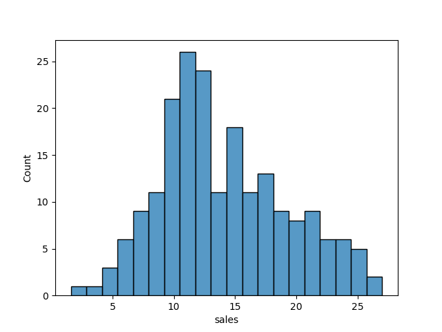

```python
# https://numpy.org/doc/stable/reference/generated/numpy.tril.html
plt.clf()
mask = np.tril(df.corr())
sns.heatmap(df.corr(), fmt=".1g", annot=True, cmap="cool", mask=mask)
plt.show()
```

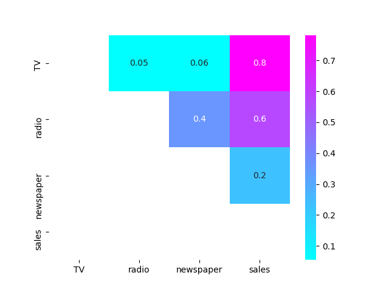

error metrics
-------------

```python
# mean absolute error
print(mean_absolute_error(y_test, test_predictions))  # 1.213745773614481

# RSME (if big diff with MAE = you've got a few data points that are way off)
print(np.sqrt(mean_squared_error(y_test, test_predictions)))  # 1.5161519375993884
coefs_df = pd.DataFrame(model.coef_, X.columns, columns=['coefficient'])
# X.columns = Index(['TV', 'radio', 'newspaper'], dtype='object')

"""
             coefficient
TV             -0.012834
radio           0.129096
newspaper      -0.058561
"""

print(model.intercept_)  # 3.1515267680706547

# with a budget of 50 for TV 30 for Radio & 10 for Newspaper, sales will be:
budget = [50, 30, 10]
test_sales = model.intercept_ +  sum(budget * model.coef_)
print(test_sales)  # 11.01006995548518
```

evaluate residuals
------------------

```python
# evaluate residuals (y-ŷ)

# residual plot showing a clear pattern = lin regression not valid
test_residuals = y_test - test_predictions

plt.clf()
sns.scatterplot(x=y_test, y=test_residuals)
plt.axhline(y=0, color='r', ls='--')  # make sure there's no clear line or curve
```

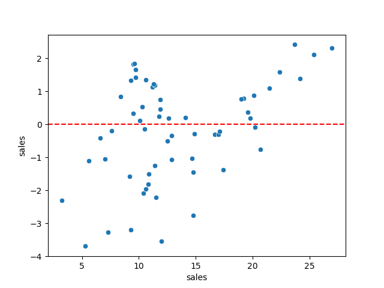

```python
# distribution plot
sns.displot(test_residuals, bins=25, kde=True)
plt.show()
```

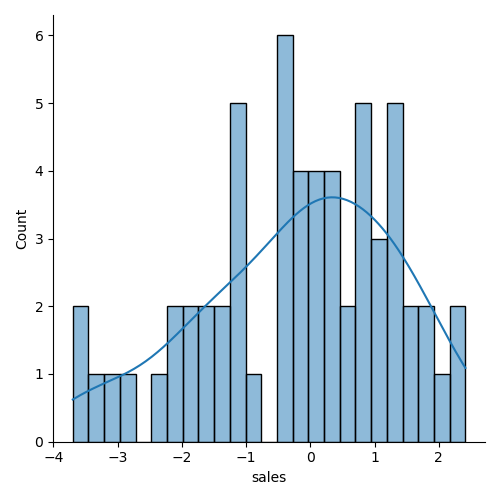

```python
# probability plot
import scipy as sp
fig, ax = plt.subplots(figsize=(6,8), dpi=100)
_ = sp.stats.probplot(test_residuals, plot=ax) # _ is convention for a throwaway variable
plt.show()
```

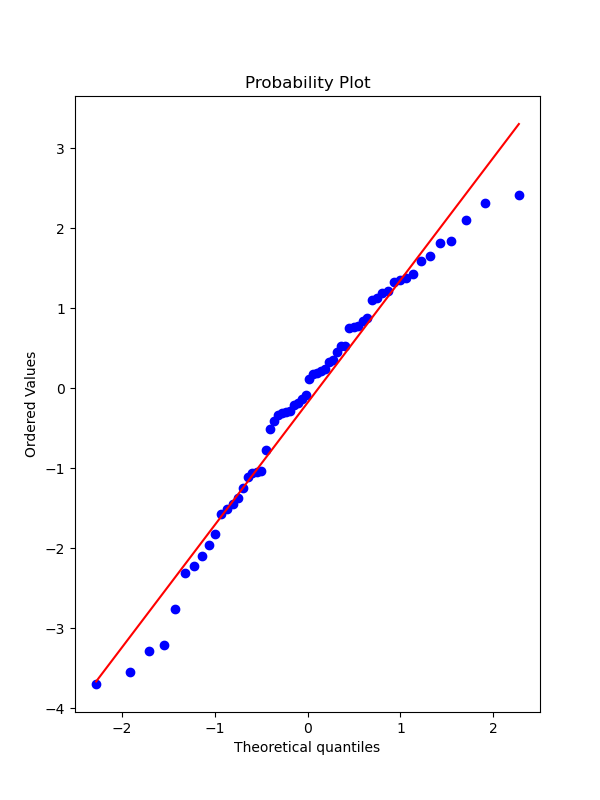

deploying model
---------------

```python
# loading & saving the model
final_model = LinearRegression()
final_model.fit(X, y)  # full dataset

# save model
from joblib import dump, load
dump(final_model, "final_sales_model.joblib")

# load model
loaded_model = load("final_sales_model.joblib")
```

interpreting coefs
------------------

```python
# interpreting the coefficients
# beta coefs tv radio newspaper
print(final_model.coef_)
[ 0.04576465  0.18853002 -0.00103749]
```

- 0 when your spend has no effect on sales
- for every 1 unit TV feature so eg 231.1 (x1000usd) we expect a sales
    increase of 0.0457 units
- for every 1000\$ spend on radio ads we expect 188 more units sold
- looks like we should drop radio feature

```python
# plotting true points vs predicted points
y_hat = final_model.predict(X)
plt.clf()
fig, axes = plt.subplots(nrows=1, ncols=3, figsize=(16,6))
axes[0].plot(df['TV'], df['sales'], 'o')  # True
axes[0].plot(df['TV'], y_hat,'o', color='red')  # predicted
axes[0].set_ylabel("Sales")
axes[0].set_title("TV Spend")

axes[1].plot(df['radio'], df['sales'], 'o')
axes[1].plot(df['radio'], y_hat, 'o', color='red')
axes[1].set_ylabel("Sales")
axes[1].set_title("Radio Spend")

axes[2].plot(df['newspaper'], df['sales'], 'o')
axes[2].plot(df['newspaper'], y_hat, 'o', color='red')
axes[2].set_ylabel("Sales")
axes[2].set_title("Newspaper Spend")
plt.tight_layout()
plt.show()
```

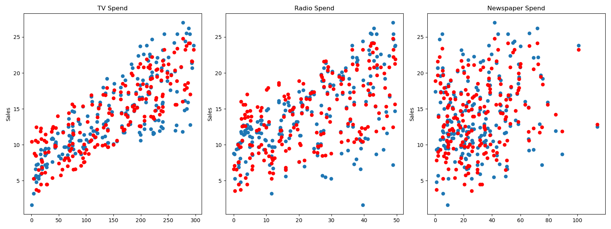

prediction test
---------------

```python
# predict for a new ad campaign
# check dimensions
X.shape  # (200, 3)

# 149 TV, 22 Radio, 12 Newspaper ads
# Sales expected?
campaign = [[149, 22, 12]]  # 2d list match it up

print(loaded_model.predict(campaign))
[13.893032]
```

polynomial
==========

addresses 2 issues: - find non-linear feature relationships to label -
interaction terms beween features

interaction terms
-----------------

aka synergy

consider **interaction terms** - what if features are only significant
when in sync with one another - eg: a newspaper ad spend by itself is
not effective but greatly increases if added to a TV ad campaign

create polynomial features
--------------------------

automatically creates both higher order feature polynomials & the
interaction terms between all feature combos

```python
import pandas as pd
import numpy as np
import seaborn as sns
import matplotlib.pyplot as plt
import sklearn

df = pd.read_csv("data/Advertising.csv")
df = df.drop("Unnamed: 0", axis=1)
print(df.head())

# X = all the features
X = df.drop("sales", axis=1)
# y = target/label
y = df["sales"]

from sklearn.preprocessing import PolynomialFeatures
# include_bias = adds in array column of 1 values
polynomial_converter = PolynomialFeatures(degree=2, interaction_only=False, include_bias=False)

# grab & analyze feature values
polynomial_converter.fit(X)
# transform
# polynomial_converter.transform(X).shape  # (200, 9)
poly_features = polynomial_converter.transform(X)
# poly_features.shape # (200, 9)

print(X.iloc[0])
print(poly_features[0])
"""
TV           230.1
radio         37.8
newspaper     69.2
Name: 0, dtype: float64
[2.301000e+02 3.780000e+01 6.920000e+01 5.294601e+04 8.697780e+03
 1.592292e+04 1.428840e+03 2.615760e+03 4.788640e+03]
"""

# in 1 step
poly_features = polynomial_converter.fit_transform(X)
```

### train and evaluate

```python
polynomial_converter = PolynomialFeatures(degree=2, interaction_only=False, include_bias=False)

# grab & analyze feature values
polynomial_converter.fit(X)
# transform
# polynomial_converter.transform(X).shape  # (200, 9)
poly_features = polynomial_converter.transform(X)
# poly_features.shape # (200, 9)

print(X.iloc[0])
print(poly_features[0])
"""
TV           230.1
radio         37.8
newspaper     69.2
Name: 0, dtype: float64
[2.301000e+02 3.780000e+01 6.920000e+01 5.294601e+04 8.697780e+03
 1.592292e+04 1.428840e+03 2.615760e+03 4.788640e+03]
"""

# in 1 step
# poly_features = polynomial_converter.fit_transform(X)

from sklearn.model_selection import train_test_split
X_train, X_test, y_train, y_test = train_test_split(poly_features, y, test_size=0.3, random_state=101)

from sklearn.linear_model import LinearRegression
model = LinearRegression()
# now calls regression model on 9 features instead of 3
model.fit(X_train, y_train)

# evaluate performance on test set
test_predictions = model.predict(X_test)
print(model.coef_)
"""[5.17095811e-02  1.30848864e-02  1.20000085e-02 - 1.10892474e-04
    1.14212673e-03 - 5.24100082e-05  3.34919737e-05  1.46380310e-04
    - 3.04715806e-05]"""

from sklearn.metrics import mean_absolute_error, mean_squared_error
MAE = mean_absolute_error(y_test, test_predictions)
MSE = mean_squared_error(y_test, test_predictions)
RMSE = np.sqrt(MSE)
print(MAE)
0.48967980448038373
print(MSE)
0.4417505510403753
print(RMSE)  # punishes your datamodel when it's off, even on just a few data points
0.6646431757269274
# does this perform better than lin reg values? lower values = better!
# so yes it does
```

### overfit underfit

choose best model parameters, how to choose optimal degree? Bias
variance trade-off aka overfitting vs underfitting

example of a model that overfits to a data set

- fits too much to the noise & variance in the training data
- will perform very well on training data but have poor
    performance on new unseen (test) data
- is harder to detect

example of a model that underfits to a data set

- model has high bias and is generalizing too much
- underfitting can lead to poor performance in both training &
    testing data sets

plot out Error vs Model complexity on training set then check
performance on the test set

in polynomial regression complexity = degree of the polynomial but many
ML algo\'s have their own hyperparameters that can increase complexity -
eg random forests can have a few trees or multiple decision trees or
large amounts of decision trees

create a loop that creates all those models for various polynomial
degrees train them, calculate error metrics for both training & test
data then visually see where we begin to spike on the test error & where
we continue to decline on the training error

```python
# create the different order polynomial
train_rmse_errors = []
test_rmse_errors = []

for d in range(1, 10):
    polynomial_converter = PolynomialFeatures(degree=d, include_bias=False)
    polynomial_features = polynomial_converter.fit_transform(X)

    # split poly features train/test
    X_train, X_test, y_train, y_test = train_test_split(polynomial_features, y, test_size=0.3, random_state=101)

    # fit model on training data
    model = LinearRegression()
    model.fit(X_train, y_train)

    # predict on train & test (get an idea on over/underfitting)
    train_pred = model.predict(X_train)
    test_pred = model.predict(X_test)

    # store/save RMSE for BOTH the train & test set
    train_rmse = np.sqrt(mean_squared_error(y_train, train_pred))
    test_rmse = np.sqrt(mean_squared_error(y_test, test_pred))

    train_rmse_errors.append(train_rmse)
    test_rmse_errors.append(test_rmse)

print(train_rmse_errors)  # value keeps going down (1 spike) as we increase complexity (it is overfitting)
"""[1.7345941243293763, 0.5879574085292231, 0.43393443569020695, 0.3517083688399345,
    0.2509342963181027, 0.20506412006370558, 5.421692177886925, 0.1446549826772545, 0.16727684104713286]"""
print(test_rmse_errors)  # overfitting becomes apparent in test set
"""[1.516151937599388, 0.6646431757269274, 0.5803286825215619, 0.5077742637898888,
    2.575814116940382, 4.331414179872115, 1379.1414986350896, 4169.996454545673, 95477.87993484356]"""

# plot the results (RMSE vs poly order)
            # scalex   # scaley
plt.plot(range(1, 6), train_rmse_errors[:5], label="Train RMSE")
plt.plot(range(1, 6), test_rmse_errors[:5], label="Test RMSE")
# plt.plot(range(1, 10), train_rmse_errors, label="Train RMSE")
# plt.plot(range(1, 10), test_rmse_errors, label="Test RMSE")
plt.ylabel("RMSE")
plt.xlabel("degree of poly")
plt.legend()
plt.show()
# conclusion: around degree 4 test RMSE explodes even as it decreases still on training set
# so we take 2nd degree or 3rd degree but not 4th degree as risk/complexity increases too much
# context is important here
```

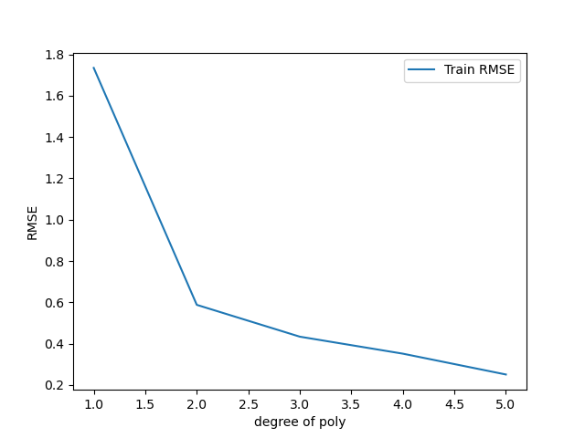

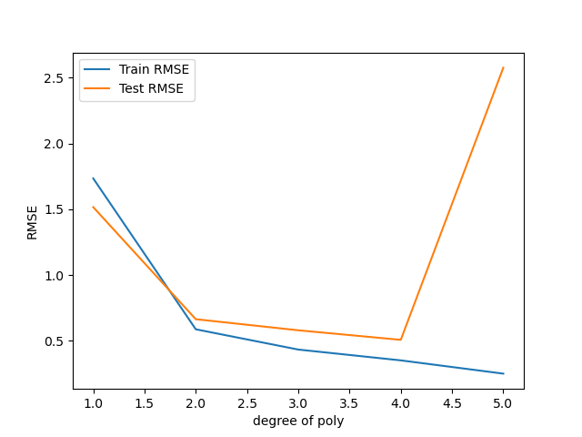

### finalizing model choice

There are now 2 things we need to save, the Polynomial Feature creator
AND the model itself. Let\'s explore how we would proceed from here:

1.  Choose final parameters based on test metrics
2.  Retrain on all data
3.  Save Polynomial Converter object
4.  Save model

```python
# Based on our chart, could have also been degree=4, but 
# it is better to be on the safe side of complexity
final_poly_converter = PolynomialFeatures(degree=3,include_bias=False)

final_model = LinearRegression()

final_model.fit(final_poly_converter.fit_transform(X),y)


from joblib import dump, load

dump(final_model, 'sales_poly_model.joblib')
# ['sales_poly_model.joblib']

dump(final_poly_converter,'poly_converter.joblib')
```

### prediction on new data

```python
# prediction on new data
loaded_poly = load('poly_converter.joblib')
loaded_model = load('sales_poly_model.joblib')

campaign = [[149, 22, 12]]
campaign_poly = loaded_poly.fit_transform(campaign)
campaign_poly
"""array([[1.490000e+02, 2.200000e+01, 1.200000e+01, 2.220100e+04,
           3.278000e+03, 1.788000e+03, 4.840000e+02, 2.640000e+02,
           1.440000e+02, 3.307949e+06, 4.884220e+05, 2.664120e+05,
           7.211600e+04, 3.933600e+04, 2.145600e+04, 1.064800e+04,
           5.808000e+03, 3.168000e+03, 1.728000e+03]])"""
final_model.predict(campaign_poly)
# array([14.64501014])
```

regularization
==============

regularization methods have a cost:

- introduce an additional hyperparameter that needs to be tuned
- a multiplier to the penalty to decide the **strength** of penalty

feature scaling
---------------

- some ML models that rely on distance metrics (KNN) **require** scaling to perform well
- improves algo\'s like gradient descent that don\'t have the property of scale invariance
- features are on different scales, those on large scales take longer to update
- you want features to be roughly on the same scale
- won\'t have an effect on regression/decision trees/random forest (no
    gradient descent)


you will also have to scale new unseen data before feeding to the model

normalization: scales all data values to be between 0 and 1

```
X - Xmin
X = -----------
Xmax - Xmin
```

- a .fit() call calculates the necessary stats (Xmin, Xmax, mean, std
    dev)
- a .transform() call scales data & returns the new scaled version of
    data

Warning

- only **fit** to training data
- calculating stat info should only come from training data
- don\'t assume prior knowledge of the test set

using the full data set = **data leakage**

feature scaling process:

- perform train test split
- fit to TRAINING feature data
- transform training feature data
- transform test feature data

don\'t scale the label

cross validation
----------------

is a more advanced set of methods for splitting data into training &
testing sets

it\'s a way to train & evaluate on all the data

- train model and get error metric for 1/K split eg 10%
- repeat for another error metric 1/K split
- keep repeating for all possible splits
- you get **mean error = expected performance**
- you get a better sense of true performance across multiple potential splits
- the cost = repeat computations K times
- a common choice is K = 10 (K-fold cross-validation)
- max K = K equal to nrows (leave on out cross-validation)

ensure data hasn\'t been influenced by/for hyperparameter tuning

- we use a **hold out** test set = remove a portion of data at start that model will never see or be adjusted to
- continue with classic train test split
- OR do K-Fold cross validation
- **after** training & tuning perform **final evaluation** hold out test set

Warning

you cannot tune after this final test evaluation!

training data \| validation data (tuning hyperparams) \| test data

data setup
----------

```python
import numpy as np
import pandas as pd
import matplotlib.pyplot as plt
import seaborn as sns

df = pd.read_csv("data/Advertising.csv")
X = df.drop(["Unnamed: 0", "sales"], axis=1)
y = df['sales']

# Polynomial Conversion
from sklearn.preprocessing import PolynomialFeatures
polynomial_converter = PolynomialFeatures(degree=3,include_bias=False)
poly_features = polynomial_converter.fit_transform(X)
print(poly_features.shape)  # (200, 19)

# Train | Test Split
from sklearn.model_selection import train_test_split
X_train, X_test, y_train, y_test = train_test_split(poly_features, y, test_size=0.3, random_state=101)
print(X_train.shape)  # (140, 19)

# scaling the data
# we only fit to the training data, and transform on both sets separately

from sklearn.preprocessing import StandardScaler
# help(StandardScaler)
scaler = StandardScaler()
scaler.fit(X_train)  # calling fit calculates Xmin & Xmax
# StandardScaler()
X_train = scaler.transform(X_train)
X_test = scaler.transform(X_test)
```

L1 reg LASSO regression
-----------------------

L1 regularization adds penalty equal to the **absolute value** of the magnitude of coefficients:

- limits the size of the coefficients
- can yield sparse models where some coefficients can become zero (helps you decide)
- can force some of the coeff estimates to be zero when tuning lambda is large enough
- similar to subset selection, LASSO performs variable selection
- models are generally much easier to interpret
- LassoCV operates on checking a \# of alphas within a range instead of providing alphas directly

```python
# Lasso Regression
from sklearn.linear_model import LassoCV
# https://scikit-learn.org/stable/modules/generated/sklearn.linear_model.LassoCV.html

lasso_cv_model = LassoCV(eps=0.1,n_alphas=100,cv=5)
lasso_cv_model.fit(X_train,y_train)
# LassoCV(cv=5, eps=0.1)
print(lasso_cv_model.alpha_)  # 0.4943070909225832

# run test predictions & compare our values
test_predictions = lasso_cv_model.predict(X_test)
MAE = mean_absolute_error(y_test,test_predictions)
MSE = mean_squared_error(y_test,test_predictions)
RMSE = np.sqrt(MSE)
print(MAE)  # 0.6541723161252867
print(RMSE)  # 1.1308001022762548

# Training Set Performance
train_predictions = lasso_cv_model.predict(X_train)
MAE = mean_absolute_error(y_train,train_predictions)
print(MAE)  # 0.6912807140820709
print(lasso_cv_model.coef_)  # its only considering 2 features! ridge, all features
"""array([1.002651  , 0.        , 0.        , 0.        , 3.79745279,
          0.        , 0.        , 0.        , 0.        , 0.        ,
          0.        , 0.        , 0.        , 0.        , 0.        ,
          0.        , 0.        , 0.        , 0.        ])"""
```

L2 reg Ridge regression
-----------------------

- ridge regression is a regularization technique (for linear regression)
  that works by helping reduce the potential for overfitting to the training data
- by adding a penalty term to the error that is based on the squared
  value of the coefficients
- minimize error term RSS + penalty term
- shrinkage penalty based off **coefficient²**
- shrinkage penalty has a **tunable lambda parameter**

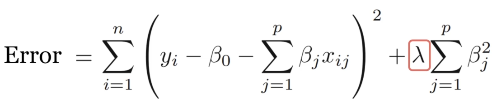

- introduce a little more **bias** to significantly **reduce**
    variance
- adding bias can help generalize ŷ= B₁x + B₀ (B₁ = slope of the line)
- won\'t fit training data as well but fit unseen data better overall
- use cross-validation to explore multiple lambda options & choose
    best one
- for cross-validation metrics, sklearn uses a **scorer object**
- **higher** return values are **better** than lower return values for
    scorer objects

```python
# Ridge Regression
from sklearn.linear_model import Ridge
ridge_model = Ridge(alpha=10)
ridge_model.fit(X_train,y_train)
# Ridge(alpha=10)
test_predictions = ridge_model.predict(X_test)

from sklearn.metrics import mean_absolute_error,mean_squared_error
MAE = mean_absolute_error(y_test,test_predictions)
MSE = mean_squared_error(y_test,test_predictions)
RMSE = np.sqrt(MSE)
print(MAE)
0.5774404204714167
print(RMSE)
0.894638646131965

# Training Set Performance
train_predictions = ridge_model.predict(X_train)
MAE = mean_absolute_error(y_train,train_predictions)
print(MAE)
0.5288348183025304
```

### choosing an alpha value with Cross-Validation

```python
from sklearn.linear_model import RidgeCV
# help(RidgeCV)
# Choosing a scoring: https://scikit-learn.org/stable/modules/model_evaluation.html
# Negative RMSE so all metrics follow convention "Higher is better"

# to choose your scorer
from sklearn.metrics import SCORERS
print(SCORERS.keys())
# dict_keys(['explained_variance', 'r2', 'max_error', 'neg_median_absolute_error', 'neg_mean_absolute_error',
# 'neg_mean_absolute_percentage_error', 'neg_mean_squared_error', 'neg_mean_squared_log_error',
# 'neg_root_mean_squared_error', 'neg_mean_poisson_deviance', 'neg_mean_gamma_deviance', 'accuracy', ...
# a higher negative MSE is better!
ridge_cv_model = RidgeCV(alphas=(0.1, 1.0, 10.0), cv=None, scoring='neg_mean_absolute_error')

# the more alpha options you pass, the longer this will take
ridge_cv_model.fit(X_train,y_train)  # only using training set for hyperparameter training!
print(ridge_cv_model.alpha_)
0.1  # the alpha that performed the best

# check performance on unseen test data
test_predictions = ridge_cv_model.predict(X_test)
MAE = mean_absolute_error(y_test,test_predictions)
MSE = mean_squared_error(y_test,test_predictions)
RMSE = np.sqrt(MSE)
print(MAE)  # 0.4273774884345441
print(RMSE)  # 0.6180719926946004

# training set performance
train_predictions = ridge_cv_model.predict(X_train)
MAE = mean_absolute_error(y_train,train_predictions)
print(MAE)  # 0.3094132105648306
print(ridge_cv_model.coef_)
"""
array([ 5.40769392,  0.5885865 ,  0.40390395, -6.18263924,  4.59607939,
          -1.18789654, -1.15200458,  0.57837796, -0.1261586 ,  2.5569777 ,
          -1.38900471,  0.86059434,  0.72219553, -0.26129256,  0.17870787,
           0.44353612, -0.21362436, -0.04622473, -0.06441449])
"""
```

L1+L2 Elastic Net regression
----------------------------

combining best of both worlds

One issue with regular least squares is that it doesn't account for the
possibility of overfitting Ridge regression takes care of this by
shrinking certain parameters Lasso takes this a step even further by
allowing certain coefficients to be outright forced to zero, eliminating
them from the model Finally, Elastic Net combines the benefits of both
lasso and ridge

- $ŷ = B₁X₁+B₂X₂$ (case of only 2 features)
- L1 constrains the sum of absolute values $|B|$
- L2 contrains the sum of squared values B²
- for some set of features the penalty will be less than sum of **s**
- Lasso regression penalty: $|B₁| + |B₂| ≤ S$
- Ridge regression penalty: $B₁² + B₂² ≤ S$

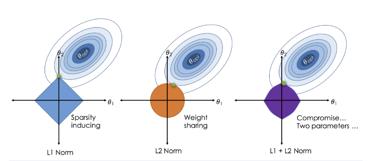

```python
## Elastic Net
Elastic Net combines the penalties of ridge regression and lasso in an attempt to get the best of both worlds!
from sklearn.linear_model import ElasticNetCV
elastic_model = ElasticNetCV(l1_ratio=[.1, .5, .7,.9, .95, .99, 1],tol=0.01)
elastic_model.fit(X_train,y_train)
# ElasticNetCV(l1_ratio=[0.1, 0.5, 0.7, 0.9, 0.95, 0.99, 1], tol=0.01)
elastic_model.l1_ratio_
1.0
test_predictions = elastic_model.predict(X_test)
MAE = mean_absolute_error(y_test,test_predictions)
MSE = mean_squared_error(y_test,test_predictions)
RMSE = np.sqrt(MSE)
MAE
0.5663262117569452
RMSE
0.7485546215633726
# Training Set Performance
# Training Set Performance
train_predictions = elastic_model.predict(X_train)
MAE = mean_absolute_error(y_train,train_predictions)
MAE
0.43075829904723684
elastic_model.coef_
array([ 3.78993643,  0.89232919,  0.28765395, -1.01843566,  2.15516144,
       -0.3567547 , -0.271502  ,  0.09741081,  0.        , -1.05563151,
        0.2362506 ,  0.07980911,  1.26170778,  0.01464706,  0.00462336,
       -0.39986069,  0.        ,  0.        , -0.05343757])
```

symptoms and remedy
-------------------


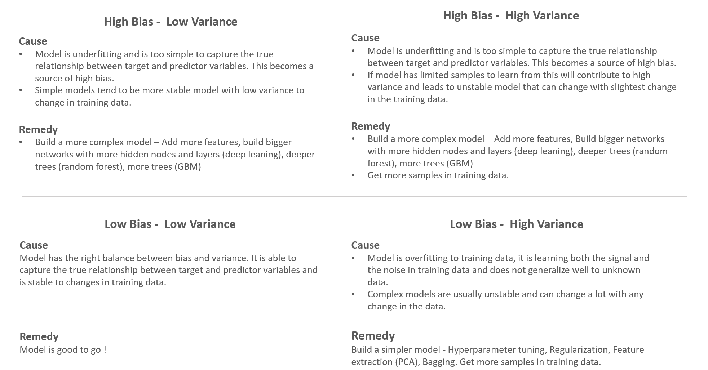

Bias-Variance Trade-off Decision Routes
---------------------------------------

between the first model we build and the final model we traverse
different decision routes till we strike the right balance between bias
and variance

Low biasLow variance:


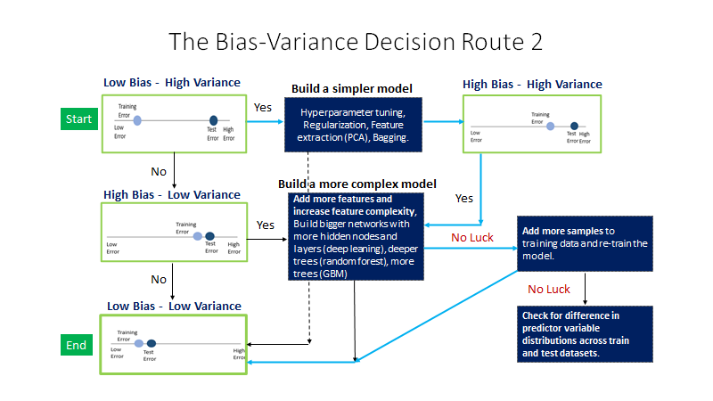

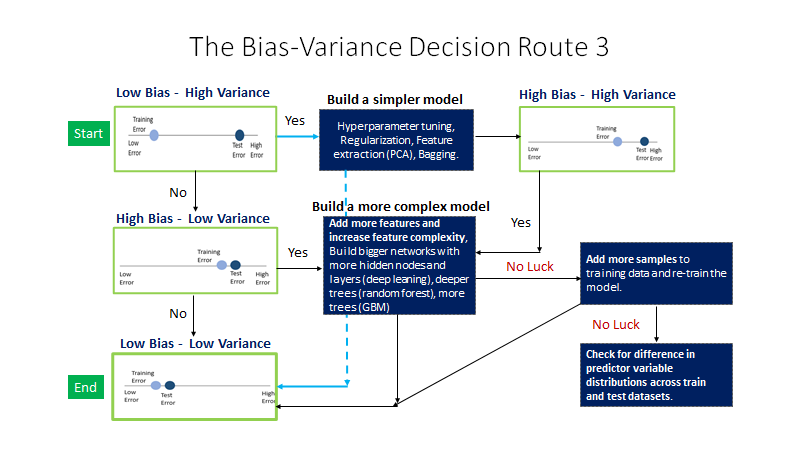

High biasLow variance:


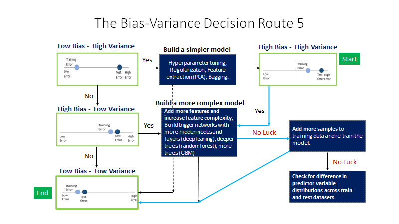

High biasLow variance:

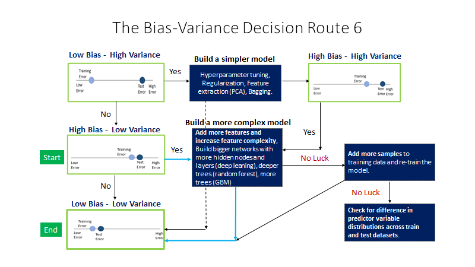


